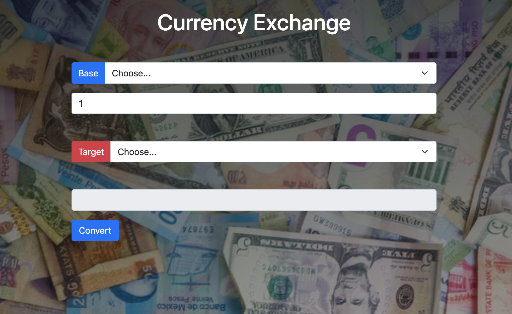

# Currency converter

## This repository was created in order to practice the acquired knowledge in Web Development.

## Goals

- Practice fetch (promises, async, await).

- Practice DOM (Document Object Model) manipulation.

- Practice Bootstrap.

## Description:

- The user will be able to select a currency and input the price.

- Then, the user will be able to convert the currency into another selected currency e.g. USD/EUR etc.

- The result will, then, be displayed to the user.

- Source API: [Cryptonator](https://www.cryptonator.com/api)

## Picture

- [Unsplash](https://unsplash.com/)
